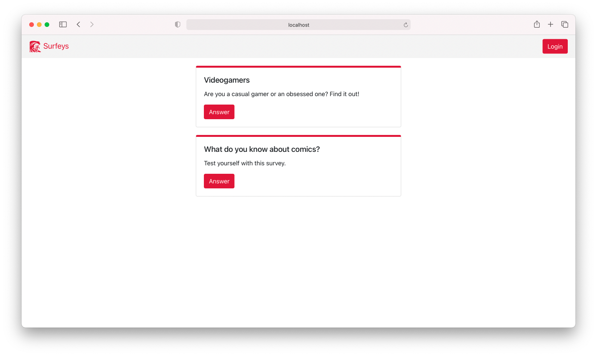
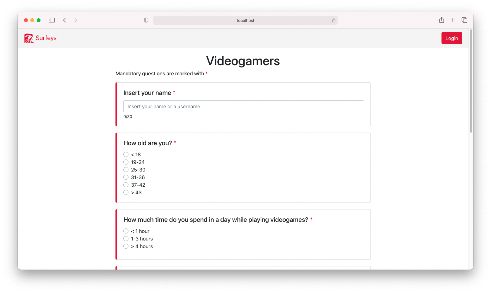
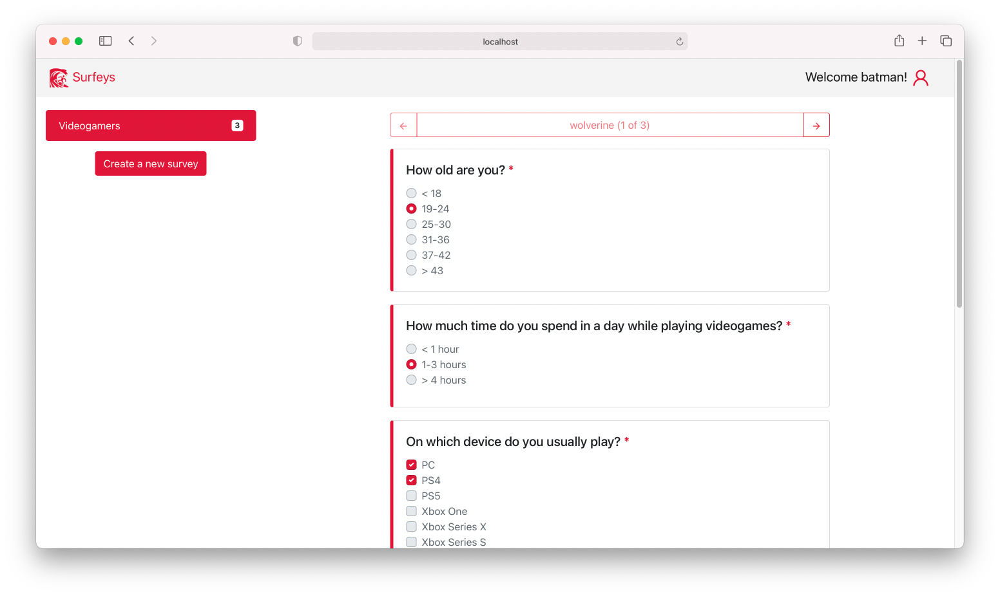
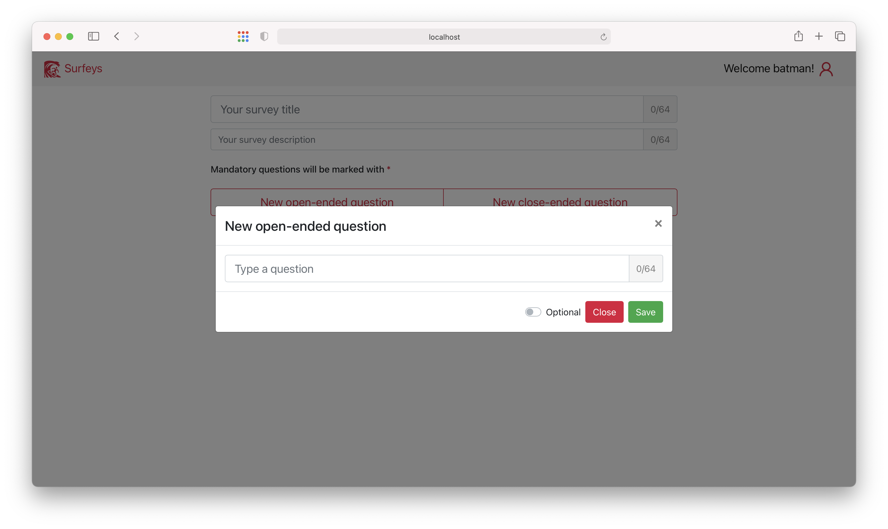
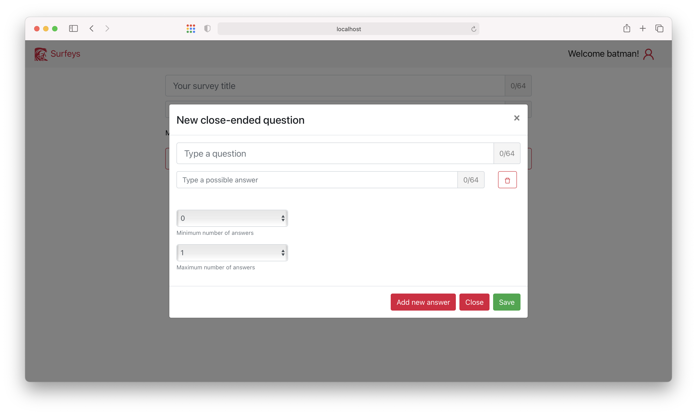
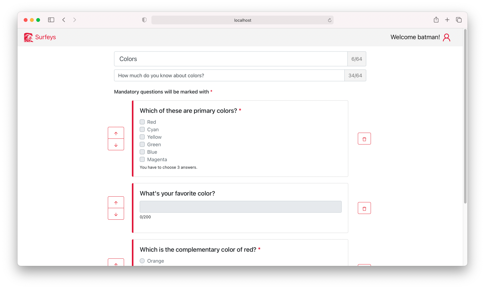

# Exam #1: "Survey"

## Student: s280105 D'ORO ENRICO

## React Client Application Routes

- Route `/`: home page for normal users
- Route `/home`: home page for admin users
- Route `/new-survey`: page for create a new survey (only for admin)
- Route `/survey`: page for answer a survey (only for normal users)

## API Server

### **GET** `/api/surveys`
  - **Request parameters:** _none_
  - **Response:** `200 OK` (success) or `500 Internal Server Error` (generic error)
  - **Response body:** an array of objects corresponing to all the surveys
  ```
  [
    {
      "sID": 1,
      "adminID": 0,
      "title": "Videogamers",
      "description": "Are you a casual gamer or an obsessed one? Find it out!",
      "number_of_answers": 3
    },
    {
      "sID": 2,
      "adminID": 1,
      "title": "What do you know about comics?",
      "descripton": "Test yourself with this survey.",
      "number_of_answers": 1
    },
    ...
  ]
  ```
### **GET** `/api/surveys/:admin`
  - **Request parameters:** the username of the admin
  - **Response:** `200 OK` (success) or `500 Internal Server Error` (generic error)
  - **Response body:** an array of objects corresponding to all the surveys created by that admin
  ```
  Example with admin = "batman"
  [
    {
      "sID": 1,
      "adminID": 0,
      "title": "Videogamers",
      "description": "Are you a casual gamer or an obsessed one? Find it out!",
      "number_of_answers": 3
    }
  ]
  ```
### **GET** `/api/surveys/:id`

  - **Request parameters:** the id of the survey
  - **Response:** `200 OK` (success) or `500 Internal Server Error` (generic error)
  - **Response body:** an object corresponding to the given survey id

  ```
  Example with id = 1

  {
    "sID": 1,
    "adminID": 0,
    "title": "Videogamers",
    "description": "Are you a casual gamer or an obsessed one? Find it out!",
    "number_of_answers": 3
  }
  ```

### **GET** `/api/questions/:id`

  - **Request parameters:** the id of the survey to which thes questions belong
  - **Response:** `200 OK` (success) or `500 Internal Server Error` (generic error)
  - **Response body:** an array of objects corresponding to all the questions of the given survey, _ordered by the id of the questions_

  ```
  Example with id = 1

  [
    {
      "sID": 1,
      "qID": 0,
      "title": "How old are you?",
      "open": 0,
      "min": 1,
      "max": 1
    },
    {
      "sID": 1,
      "qID": 1,
      "title": "How much time do you spend in a day while playing videogames?",
      "open": 0,
      "min": 1,
      "max": 1
    },
    ...
  ]
  ```

### **GET** `/api/offered-answers/:sID/:qID`

  - **Request parameters:** the id of the survey and of the question
  - **Response:** `200 OK` (success) or `500 Internal Server Error` (generic error)
  - **Response body:** an array of objects corresponding to all the possible answers of a specific question of a given survey, _ordered by the id of the answers_

  ```
  Example with sID = 1 and qID = 0

  [
    {
      "sID": 1,
      "qID": 0,
      "aID": 0,
      "text": "< 18"
    },
    {
      "sID": 1,
      "qID": 0,
      "aID": 1,
      "text": "19-24"
    },
    {
      "sID": 1,
      "qID": 0,
      "aID": 2,
      "text": "25-30"
    },
    ...
  ]
  ```

### **GET** `/api/answers/:id`

  - **Request parameters:** the id of the survey from which to retrieve user answers
  - **Response:** `200 OK` (success) or `500 Internal Server Error` (generic error)
  - **Response body:** an array of objects corresponding to a collection of answers given by all the users that answered to this specific survey, _ordered by the id of the users_

  ```
  Example with id = 1

  [
    {
      "id": 1,
      "sID": 1,
      "qID": 0,
      "aID": 1,
      "text": NULL
    },
    {
      "id": 1,
      "sID": 1,
      "qID": 1,
      "aID": 1,
      "text": NULL
    },
    ...,

    {
      "id": 2,
      "sID": 1,
      "qID": 0,
      "aID": 1,
      "text": NULL
    },
    {
      "id": 2,
      "sID": 1,
      "qID": 1,
      "aID": 0,
      "text": NULL
    },
    ...
  ]
  ```

### **GET** `/api/users/:id`

  - **Request parameters:** the id of the survey
  - **Response:** `200 OK` (success) or `500 Internal Server Error` (generic error)
  - **Response body:** an array of objects corresponding to all the users that answered to this specific survey, _ordered by the id of the users_

  ```
  Example with id = 1

  [
    {
      "uID": 1,
      "username": "wolverine",
      "sID": 1
    },
    {
      "uID": 2,
      "username": "spiderman",
      "sID": 1,
    },
    {
      "uID": 3,
      "username": "daredevil",
      "sID": 1,
    }
  ]
  ```

### **POST** `/api/sessions/`
  - **Request body:** an object containing the user credentials
  - **Response:** `200 OK` (success) or `401 Unauthorized` (unauthorized user)
  - **Response parameters:** the id of the logged admin
### **DELETE** `/api/sessions/current/`
  - **Request parameters:** _none_
  - **Response:** _none_
  - **Response parameters:** _none_
### **GET** `/api/getCurrentUser`
  - **Request parameters:** _none_
  - **Response:** `200 OK` (success) or `401 Unauthorized` (unauthenticated user)
  - **Response parameters:** the id of the logged admin
### **POST** `/api/addUser/`
  - **Request body:** an object corresponding to a new user that has answered to a survey
  - **Response:** `201 Created` (success) or `503 Service Unavailable` (generic error)
  - **Response parameters:** the id of the new user
### **POST** `/api/addUserAnswer/`
  - **Request body:** an object corresponding to a single answer given by a user to a certain question (of a specific survey)
  - **Response:** `201 Created` (success) or `503 Service Unavailable` (generic error)
  - **Response parameters:** _none_
### **POST** `/api/addSurvey/`
  - **Request body:** an object corresponding to a new survey created by an admin
  - **Response:** `201 Created` (success) or `503 Service Unavailable` (generic error)
  - **Response parameters:** the id of the survey created
### **POST** `/api/addQuestion/`
  - **Request body:** an object corresponding to a new question related to a specific survey
  - **Response:** `201 Created` (success) or `503 Service Unavailable` (generic error)
  - **Response parameters:** the id of the question created
### **POST** `/api/addAnswer/`
  - **Request body:** an object corresponding to a new possible answer of a question related to a specific survey
  - **Response:** `201 Created` (success) or `503 Service Unavailable` (generic error)
  - **Response parameters:** _none_

## Database Tables

### Table `admins` - contains the admins credentials

| Name     | Data type |
| :------- | :-------- |
| id       | INTEGER   |
| username | TEXT      |
| hash     | TEXT      |

### Table `users` - contains the users that submit their answers

| Name     | Data type |
| :------- | :-------- |
| uID      | INTEGER   |
| username | TEXT      |
| sID      | INTEGER   |

### Table `surveys` - contains the surveys created by the admins

| Name              | Data type |
| :---------------- | :-------- |
| sID               | INTEGER   |
| adminID           | INTEGER   |
| title             | TEXT      |
| description       | TEXT      |
| number_of_answers | INTEGER   |

### Table `questions` - contains all the questions of all the surveys

| Name  | Data type |
| :---- | :-------- |
| sID   | INTEGER   |
| qID   | INTEGER   |
| title | TEXT      |
| open  | INTEGER   |
| min   | INTEGER   |
| max   | INTEGER   |

### Table `offered_answers` - contains all the possible answers to all the questions

| Name | Data type |
| :--- | :-------- |
| sID  | INTEGER   |
| qID  | INTEGER   |
| aID  | INTEGER   |
| text | TEXT      |

### Table `given_answers` - contains all the answers given by all users to all the questions

| Name | Data type |
| :--- | :-------- |
| id   | INTEGER   |
| sID  | INTEGER   |
| qID  | INTEGER   |
| aID  | INTEGER   |
| text | TEXT      |

## Main React Components

- `Home` (in `Home.js`): it's the main component for a logged user (admin). Allows to navigate between own created surveys and to create a new one.
- `LoginModal` (in `Modal.js`): it appears after clicking on the `Login` button. From here a user can log in and create his own surveys.
- `OpenQuestionModal` (in `Modal.js`): used by an admin to create a new open-ended question for their survey.
- `ClosedQuestionModal` (in `Modal.js`): used by an admin to create a new close-ended question (single or multiple choice) for their survey.
- `NewSurvey` (in `NewSurvey.js`): it's rendered after clicking the `Create a new survey` button in the `Home` component. It contains all the necessary to create and save a new survey.
- `QuestionCardAdmin` (in `QuestionCard.js`): it renders three types of questions card (open-ended, close-ended single choice, close-ended multiple choice) right after the creation of a question by an admin. It's used as reminder for the admin and can be removed or ordered.
- `QuestionCard` (in `QuestionCard.js`): it renders three types of questions card (open-ended, close-ended single choice, close-ended multiple choice) from the user point of view (enabled, editable `Form.Control`) or from the admin point of view when he lists the users answers (disabeld, not editable `Form.Control`).
- `SubmitSurvey` (in `SubmitSurvey.js`): it's rendered after clicking the `Answer` button of a survey. It contains all the necessary for a user to submit his own answers to a survey.
- `SurveyCard` (in `SurveyCard.js`): it's the card used in the user home page to render each survey, with a button that allows a user to answer to that survey.
- `TitleBar` (in `TitleBar.js`): it's the navbar present in every route. It provides a `Login` button that is replaced with the username once logged in.

## Screenshot

### Normal user interface
*User home screen*

*User answering a survey*


### Admin interface
*Admin home screen*

*Admin creating a new open-ended question*

*Admin creating a new close-ended question*

*Admin creating a new survey*


## Users Credentials

- **username:** batman, **password:** robiniloveyou
- **username:** joker, **password:** batmanihateyou
